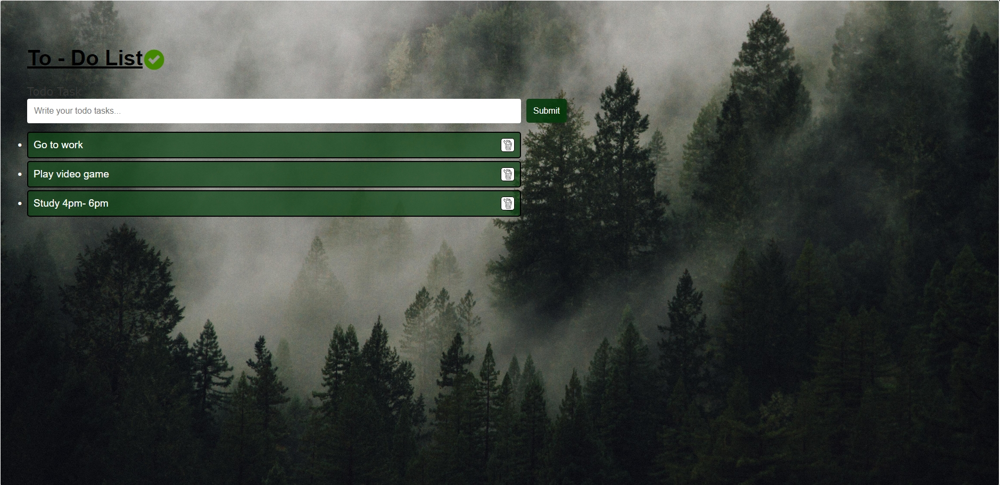

<h1 style="font-size: 30px;">To-Do List Application</h1>
A simple and user-friendly To-Do List application built with JavaScript. This app allows users to efficiently manage tasks by adding, deleting, and storing items using localStorage for persistent data.

## ✨Features

1. Add Tasks: Users can easily add new tasks using an input field and an "Add" button.
2. Delete Tasks: Remove tasks from the list with a delete button for each item.
3. Local Storage: Tasks are saved in the browser's localStorage, ensuring persistence even after the page is refreshed or the browser is closed.

## ✨ How It Works

- Enter a task in the input field.
- Click the "Submit" button to add the task to the list.
- Tasks are displayed below the input field, each with a delete button.
- Click the delete button to remove a task from the list.
- Tasks are automatically saved to localStorage and reloaded when the page is revisited.
- 
## 🛠️ Built With  

-  React: For building the user interface.
-  CSS: For styling the calculator.
-  Vite: For faster development and bundling.

## Screenshots

## **Main Interface**

---

## License

This project is licensed under the MIT License - see the [LICENSE](MIT-LICENSE) file for details.
